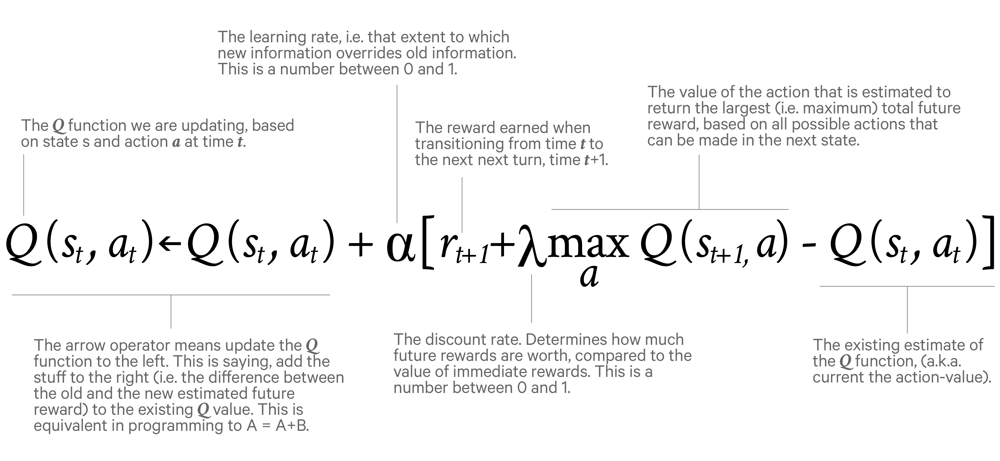

## Introduction and Overview

Experience through wins and losses leading to refinement in decision making is the crux of the model that I will be discussing in this article.<strong>Q-learning </strong>(the 'Q' standing for quality) is an<strong> off-policy</strong> learning model based on 'states','actions' and 'rewards'. It is highly suitable for situations where the number of possibilities is<strong> too high for a computer to completely process at once</strong>. Board games such as Chess and Go are examples where the Q learning algorithms have flourished, beating the top players in the world.

For my project, I have created a Game-Bot that plays the popular game of Tic-Tac-Toe, but on a 4x4 matrix instead of a 3x3 (three consecutive X's or O's are still a victory). I set the rules in a manner where the chances of losing are high, compared to a normal 3x3 matrix game, so that the learning curve for the AI algorithms is steeper. All the code can be found under the '4x4TicTacToe' repository on my GitHub profile.

A 'state', in this case, is a given situation on the board. An 'action' is a move that is possible for the bot to take. We start from a randomly generated state, and take actions on it. Depending on the final outcome of these 'state-action' pairs of the bot versus itself, a 'reward' of +1 is awarded to the final actions leading to a victory. From here on, the following Q-learning algorithm is implemented, which ensures that the actions following that victory are rewarded with a 'discounted' value.

 

The state-action Q-value table generated by continual evaluation of Q-values is basically a <strong>probabilistic model</strong> of approach for the bot. It starts off with knowledge of nothing, performing random moves and winning or losing. It is much more naive than a human being at this stage, as it has almost no cognitive capabilities. In a few iterations of training, it reaches a level that seems to be nearly unbeatable by human beings.

The only hyper-parameters of this algorithm are the learning rate and the discount rate. The learning rate affects the amount of weightage given to new information being added to the system. The discount rate, as aforementioned, is a parameter that affects the depth preference of analysis.

In very simple games, a Q-table is implemented, which contains all possible state-action pairs with their respective Q-values computed and stored. In the game that I propose, this number amounts to approximately 14.5*16 million state-action pairs. If you consider 4 bytes per value, the total size of the Q-table for such a seemingly simple board game is 13.5 Tera-bytes.<strong> This computational impracticality is overcome by using a function approximator instead of the actual Q-table</strong>. I have used a neural network for this purpose.

## Overall implementation

### Forming the Q-table*

The first thing we need to do is to program the bot to learn what the winning moves are. The bot learns this through experience over lots of playing and exploring using the aforementioned algorithm. The table comprises of many states, with values for most of the actions possible on that state. The longer we calculate this Q-table, the more optimized are our bot's moves. Here's the code for the core function that calculates the Q-values for a given state, and puts them into a table.

import numpy as np
import time

def QtableUpdate(table,tstate):
	gam = 1
	for i in range(int((np.count_nonzero(tstate)+1)/2)):
		tstatepresent = False
		action = RemoveAction(tstate)
		tstate = np.subtract(tstate,action)
		if TermStateCheck(tstate):
		break
for checker in range(len(table)):
	if(np.array_equal(table[checker][0],tstate)):
		tstatepresent = True
	if(tstatepresent):
		row1 = index_2d(table,tstate)
		col1 = getActionNumber(action)
	if gam &amp;amp;amp;amp;amp;amp;amp;amp;amp;amp;amp;gt; table[row1][col1]:
		table[row1][col1] = gam
	else:
		table.append([])
	table[len(table)-1].append(tstate)
for i in range(16):
	table[len(table)-1].append(0)
	row1 = index_2d(table,tstate)
	col1 = getActionNumber(action)
	table[row1][col1] = gam
	gam*=0.9
(% endhighlight}

This is iterated over many randomly generated terminal states with 5,7,9...15 number of total elements, to arrive at the final Q-table.

We do not actually need to store the calculated Q values in a table for aforementioned reasons. The code given is only to improve the reader's insight into the math behind the Q-values and Q-table computations. This code will be reshaped and used in a slightly different approach to compute the Q-values for a neural network instead of saving them into a table. This is 2017, not 1992.

{: .notice-alert}

### Neural Network implementation

As it can be seen from the results, the time taken for 1000 states, as we go on saving the Q-table and making it larger, increases in an arithmetic progression of about 30s per batch. This makes training impractical as the amount of data required to be saved as well as the computational time of 86 hours for one epoch(episode) of q table calculation are quite impractical. Instead, a neural network does the job of mimicking the Q-table by fitting the states with their corresponding optimum actions. This is done for multiple reasons :
<ul>
<li>Even though individual Q-value computation times might not vary too much, we do not need to save a Q-table or search through it every time we randomly generate states. This gets rid of the initial Arithmetic Progression, and reduces the overall sum of the time required to train out game-bot.</li>
<li>Since we will stumble upon a given state multiple times, and also that a Q-function is defined and continuous for every state in our defined coordinate-space, a neural network implementation is perfect for the task at hand. Over-fitting concerns and inaccurate predictions are minimized by the inherent characteristics of the process by which Q-values are being calculated, and these are automatically not much of an issue.</li>
</ul>

### So, here's the final procedure that I have followed to train the bot:

<ol>
<li>Set up a fully connected neural network to accept a state of the board, and give out Q-values for all possible actions.</li>
<li>In every instance of training, feed in a randomly generated state (s).
With a probability of ? (epsilon), take a random action (a), else take the action predictedby the neural network (a) from the Q-value array outputted to us. (qval)</li>
<li>In the new state (s'), get the maximum of predicted Q-values from the neural network (again)</li>
<li>The loss function = qval with the element corresponding to action a changed to reward(s') + (gamma * maxQ).</li>
<li>Train for many randomly generated states.</li>
</ol>

### NOTE : If s' is a terminal state, maxQ = 0.

And, we can add the "experience replay" methods, to prevent catastrophic forgetting effects*, as follows:
<ol>
<li>In state s, take action a, observe new state s(t+1) and reward r(t+1).
Store this as a tuple (s,a,s(t+1),r(t+1)) in a list.</li>
<li>Continue to store each experience in this list until we have filled the list to a specific length (up to you to define).</li>
<li>Once the experience replay memory is filled, randomly select a subset (e.g. 40).</li>
<li>Iterate through this subset and calculate value updates for each; store these in a target array (e.g. y_train) and store the states of each memory in X_train.</li>
<li>Use X_train and y_train as a mini-batch for batch training. For subsequent epochs where the array is full, just overwrite old values in our experience replay memory array.</li>
</ol>

*Catastrophic forgetting is the problem of neural network implementation where if we approach the states unilaterally, without much randomization in the batches, the neural network gets acquainted to static goals. In our game, the goals are pretty static, and hence this method won't help much. In other more complex games, where the same action set from the same initial state might not lead to victory even if it initially did, the network gets confused and learning isn't effective UNLESS the batches to train the network are randomized.
{: .notice}

We shall use the following reward function for getting the target outputs:

We want our bot to prefer victory, a draw,a loss and then finally an unacceptable move. The algorithm works well if the reward function is coherent with what we want our bot to learn in a prioritized manner.

### Neural Networks competing with each other

So now that the basics are out of the way, let's get more technical. Q-learning has to be implemented separately in separate games keeping the foundational principles in mind. Since our game involves two players playing in turns, <strong>we need two neural networks to achieve learning</strong>. I'm using keras to implement two sequential models of fully connected neural networks, that will be fighting each other with interdependant cost functions (more about this in the next section). Each neural net will have the formation and constraints that I've previously introduced, with the reward function making sure that it learns the right things.

Here is the code for the two networks simultaneously competing to learn the game:

So that's about it! Some basic things to note were that I tinkered with the epoch numbers, iteration numbers and the learning rates of each model individually and the aforementioned is the best combination that I could come up with. Any suggestions and/or improvements would be greatly appreciated!

### How is this working? What's really happening?

In every instance of training, we are maintaining the relation of the Q-value of a state action pair and the next state, simply because that is what we have set our targeted output as. We fit both the networks in such a manner that Q(s,a)= reward(s') + (gamma * maxQ(s',all a'). Thus the connect is maintained. Now, for the case where s' is terminal, we are rewarding s with +10 and that's it. Similarly we have defined the set of terminal state related rewards for the preceding states' Q-values. This is consistent with what we ACTUALLY want to approximate.

Hence, we're maintaining the connect between states, and are being consistent in rewards with the actual Q-table. This is leading to an overall approximation of the Q-table itself. The randomized actions and experience replays are just tools to enhance this basic essence of the process.

The math behind Q-learning is very concrete. It ensures that the Q-learning approximator has a possible point of convergence, and there are no odd cases like a forever increase/decrease to infinity in either case. There are no local minima, and this becomes a typical problem of convex optimization.
{: .notice}

## Results

The results of the above implementation are quite interesting. The loss function does not always decrease like depicted for a typical neural network fitting implementation. It jumps up and down as new game states are discovered, but the maximas and the overall running averages reduce over time. In this exact case, the neural networks played around<strong> 30,000 games</strong>, and then produced a win-rate of <strong>92% versus a random player</strong> starting from an empty board. It learned the rules of the game, and learned actions that lead to victories in a training time of approximately 4-5 minutes.

In the following graph, each point represents the average loss of every game played by model1. Notice how there are sudden jumps, when new states are being introduced to the network, but it is showing a general downtrend as it gets closer and closer to the actual Q-table approximations.

 

The following is a randomly picked example that 'model1' (X player) played vs a randomized player:

[ _ _ _ _ ] 
[ _ _ _ _ ] 
[ _ _ _ _ ] 
[ _ _ _ _ ] 

======================================

[ _ _ _ _ ] 
[ _ _ _ _ ] 
[ _ X _ _ ] 
[ _ _ _ _ ] 

======================================

[_ _ _ _ ] 
[_ O _ _ ] 
[_ X _ _ ] 
[_ _ _ _ ] 

======================================

[_ _ _ _ ] 
[X O _ _ ] 
[_ X _ _ ] 
[_ _ _ _ ] 

======================================

[_ O _ _ ] 
[X O _ _ ] 
[_ X _ _ ] 
[_ _ _ _ ] 

======================================

[_ O _ _ ] 
[X O _ _ ] 
[_ X _ _ ] 
[_ _ X _ ] (model1 wins)

=======================================

Clearly, the bot has learnt the rules of the game, and how to win the game. From my observations, further improvements can be made in the field of defense and even more optimization in the moves is still possible. In my opinion, further micoadjustments in the neural network configuration and training rates can lead to an even higher winrate, and possibly even a perfect bot.

That concludes my current experiments in the field of Q-learning with neural networks.

## Suggested Reads and study articles:
<a href = "https://www.cs.toronto.edu/~vmnih/docs/dqn.pdf">https://www.cs.toronto.edu/~vmnih/docs/dqn.pdf</a> - Atari with Q-learning.
<a href = "https://www.youtube.com/watch?v=Vz5l886eptw">https://www.youtube.com/watch?v=Vz5l886eptw</a> - Hvass Labs Tutorials
<a href = "http://mnemstudio.org/path-finding-q-learning-tutorial.htm">http://mnemstudio.org/path-finding-q-learning-tutorial.htm</a> - For clarifications on Q-table formations
