## Introducing Recurrent Neural Networks
 There are multiple instances where our thoughts have a context to refer to. They have meaning both in the syntactical and temporal sense. Tradition neural networks <strong>do not</strong> have such abilities. These networks throw away all previous information related to any issue and always start afresh with input data. There is no component of the network which persists over time. Trying to generate lyrics of a song, or any other style of text is one application where such neural networks fail miserably, because the characters to be generated depend upon the characters that preceede it (assuming our network is a character-level generating model). Such sequential procession requres a special kind of setup, and the most common one in industrial use today is the<strong> Recurrent Neural Network (RNN)</strong>. 

In their simplest sense, RNNs, as the name suggests, are basic neural network layers set up in a recursive fashion. The following is a typical representation of a simple RNN. 
<figure>
	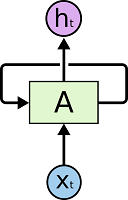 
	<figcaption style="color:black;">A compact RNN representation</figcaption>
</figure>

In the figure above, the box <strong>'A'</strong> is referred to as an '<strong>RNN Cell</strong>' or '<strong>RNN Unit</strong>'. It is a combination of simple mathematical operations of matrix multiplication and addition followed by non-linearity introduction, akin to simple feed-forward neural networks. As it has been indicated, this operation is repeated over multiple '<strong>time-steps</strong>', generating an output vector at each timestep.

It should be kept in mind that this setup is established so as to make it feasible to subject it to backpropagation-through-time. (More on that later in the article)
{: .notice}

A more intuitive perspective is that of 'unfolding' the aforementioned RNN. The recursion can be thought of as multiple copies of the same network, each passing a message to its successor. The following diagram shall make this clear. 
<figure>
	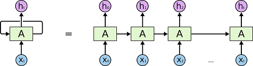 
	<figcaption style="color:black;">The full RNN representation</figcaption>
</figure>

## Qualitative understanding 
 Now that we know the structure of a typical RNN, lets analyze what it achieves.

In my experience of understanding what sort of function is approximated by the network, the information that is provided to each effective "layer" of a network is quintessential in figuring out what the network learns. 
{: .notice}

We are inputting the <strong>previous</strong> timestep information during the computation of our current state, along with the new input of the current timestep. This essentially transfers the entire sequence of the input data to the RNN, timestep by timestep, as follows :

<strong>(input + empty_hidden) -> hidden -> output</strong> 
<strong>(input + prev_hidden) -> hidden -> output</strong> 
<strong>(input + prev_hidden) -> hidden -> output</strong> 
<strong>(input + prev_hidden) -> hidden -> output</strong> 

 
So, its clearly understood that the RNN performs a sequence wise analysis of the entire corpus provided to it, which is exactly it's purpose! RNNs are 'Markov Models' indicating that the current state contains the information from all the states preceeding it. (But this does imply a load of mathematical possibilities with RNNs which we won't be getting into)

There are a few things to note here:
<ul>
    <li>You can think of the hidden state s(t) as the memory of the network. s(t) captures information about what happened in all the previous time steps. The output at step o(t) is calculated solely based on the memory at time t. As briefly mentioned above, it’s a bit more complicated  in practice because s(t) typically can’t capture information from too many time steps ago.</li>
    <li>Unlike a traditional deep neural network, which uses different parameters at each layer, a RNN shares the same parameters (U, V, W above) across all steps. This reflects the fact that we are performing the same task at each step, just with different inputs. This greatly reduces the total number of parameters we need to learn.</li>
    <li>The above diagram has outputs at each time step, but depending on the task this may not be necessary. For example, when predicting the sentiment of a sentence we may only care about the final output, not the sentiment after each word. Similarly, we may not need inputs at each time step. The main feature of an RNN is its hidden state, which captures some information about a sequence.</li>
</ul>

There are multiple advantages of RNNs over traditional ML techniques for sequence based input data:
<ul>
	<li>The RAM scaling of the model happens with the timestep and model lengths and not with the size of the input data</li>
	<li>There is a lot more non-linearity possible without coming up with new learning algorithms than traditional models</li>
</ul>

## Backpropagation through time and vanishing gradients

All the aforementioned mathematical setups are differentiable throughout their domain space. This has been the major reason for creating this specific kind of system. Backpropagation through time (BTT) enables the application of the famous gradient descent algorithm over all the timesteps during training. 

The following are the the relevant quantities required to perform BTT : 
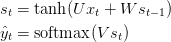
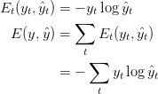
### And finally, comes the procedure for gradient descent:

 Our goal is to calculate the gradients of the error with respect to our parameters U, V and W and then learn good parameters using Stochastic Gradient Descent. Just like we sum up the errors, we also sum up the gradients at each time step for one training example:  
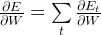

We use the chain rule of differentiation to calculate all the relevant gradients, an example for E(3) error is given as follows :
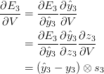

It gets a bit more complex for the parameters W and U, I leave that to the reader to figure out and get a hold of the math involved. I shall present them with the results. 
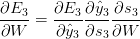
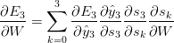

Basically, BPTT is a fancy way of saying that we will be summing up the gradients through all the timesteps. In a traditional FFNN, this is not necessary as Parameter Sharing (Deep Leaning : Ian Goodfellow has an interesting take on this matter) does not occur in traditional networks. BPTT can very well be though of as traditional backpropagation of an unrolled RNN, with the same parameters in each layer, ofcourse. 

### Vanishing Gradient Problem
 We can re-write the gradient of the error function as:
 or as :
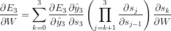
As you can see, we're multiplying a lot of derivatives here. It turns out (I won’t prove it here but this paper goes into detail) that the 2-norm, which you can think of it as an absolute value, of the above Jacobian matrix (a matrix used to create a resultant of the differentiations above) has an upper bound of 1. This makes intuitive sense because our tanh (or sigmoid) activation function maps all values into a range between -1 and 1, and the derivative is bounded by 1 (1/4 in the case of sigmoid) as well.

<figure>
	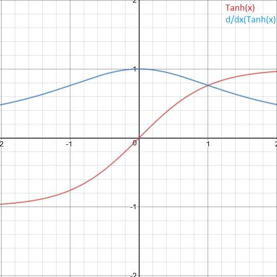 
	<figcaption style="color:black;" >We're dealing with a lot of unit-bounded values!</figcaption>
</figure>

This creates a big problem in RNNs. As we go back in timesteps, the gradients decay exponentially and flat-line quite quickly. This means that RNNs fail to make links which are to be identified by long sequences as far away states do not contribute to the information being learnt at that instance.  
Another similar problem similar to the vanishing problem is <strong>the exploding gradient problem</strong>, wherein the partial derivates begin to eplode and reach very high magnitudes. They soon reach (NaN) vlaues as they cross the computational limit of the proramming language and the network program crashes.

### And that is precisely where LSTM's come into picture. 

## Long Short Term Memory Recurrent Neural Networks
 As we have seen earlier, the vanishing gradient problem needs to be tackled by some sort of <strong>direct</strong> information that is transmitted throughout the network, and not mixed in some hidden layer message as is the case in RNNs, to remove gradient dependencies and prevent vanishing over timesteps.

LSTMs help preserve the error that can be backpropagated through time and layers. By maintaining a more constant error, they allow recurrent nets to continue to learn over many time steps (over 1000), thereby opening a channel to link causes and effects remotely. This is one of the central challenges to machine learning and AI, since algorithms are frequently confronted by environments where reward signals are sparse and delayed, such as life itself. (Religious thinkers have tackled this same problem with ideas of karma or divine reward, theorizing invisible and distant consequences to our actions).

<figure>
	 
	<figcaption style="color:black;">A typical LSTM representation, steps qualified below</figcaption>
</figure> 

This is achieved in LSTM RNNs by a <strong>"cell-state" mechanism</strong>. It runs down the entire recursive chain, and each timestep can add or remove information from it in a very simple linear manner through structures called 'gates'. As mentioned for RNNs, LSTM RNNs are also differentiable at every step and hence can be subjected to backpropagation through time (gradient descent optimization). 

In a typical LSTM cell, devoid of further modifications, there are two major steps (standard annotation followed): 
<ol>
	<li><strong>Cell state updation</strong></li>
	<ul>
		<li><strong>Forget layer gate</strong> The first gate outputs a number between 0 and 1 (with the sigmoid activation) after looking at the previous hidden state and the input for the current timestep, for each number in the cell state, followed by a simple matmul.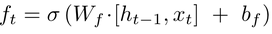</li>
		<li><strong>Input layer gate</strong> The next step is to decide what new information we’re going to store in the cell state. This has two parts. First, a sigmoid layer called the “input gate layer” decides which values we’ll update. Next, a tanh layer creates a vector of new candidate values, C(t), that could be added to the state. In the next step, we’ll combine these two to create an update to the state.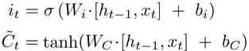</li>
		<li>The following operation is performed on the cell state to update its information for the given timestep: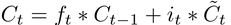</li>
	</ul>
	 
	<li><strong>Output formation gate</strong> The output is based on a filtered version of the cell state. The neural network gate decides what to output and what to reject, and this is multiplied with a sqaushed version of the cell state to obtain the final output for the next cell.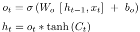</li>
</ol>
### Clearly, the aforementioned mechanism is being followed in this sort of mathematical setup with information persistency being the main goal in mind. 
 

It should be kept in mind that the aforementioned structure is the fundamental LSTM configuration and multiple advanced variations have been created for use at industry level. Every configuration has it's own advantages, and the optimum model depends depending on the type of data to be learnt.
{: .notice}

## Code and results for the project, a character level text predictor



import numpy
from keras.models import Sequential
from keras.layers import Dense
from keras.layers import Dropout
from keras.layers import LSTM
from keras.callbacks import ModelCheckpoint
from keras.utils import np_utils
filename = "input.txt"
raw_text = open(filename).read()
raw_text = raw_text.lower()
chars = sorted(list(set(raw_text)))
char_to_int = dict((c, i) for i, c in enumerate(chars))
n_chars = len(raw_text)
n_vocab = len(chars)
seq_length = 100
dataX = []
dataY = []
for i in range(0, n_chars - seq_length, 1):
	seq_in = raw_text[i:i + seq_length]
	seq_out = raw_text[i + seq_length]
	dataX.append([char_to_int[char] for char in seq_in])
	dataY.append(char_to_int[seq_out])
n_patterns = len(dataX)
X = numpy.reshape(dataX, (n_patterns, seq_length, 1))
X = X / float(n_vocab)
y = np_utils.to_categorical(dataY)
model = Sequential()
model.add(LSTM(1000, input_shape=(X.shape[1], X.shape[2]), return_sequences=True))
model.add(Dropout(0.5))
model.add(LSTM(800))
model.add(Dropout(0.5))
model.add(Dense(y.shape[1], activation='softmax'))
model.compile(loss='categorical_crossentropy', optimizer='adam')
filepath="weights-improvement-{epoch:02d}-{loss:.4f}-bigger.hdf5"
checkpoint = ModelCheckpoint(filepath, monitor='loss', verbose=1, save_best_only=True, mode='min')
callbacks_list = [checkpoint]
model.fit(X, y, epochs=50, batch_size=64, callbacks=callbacks_list)



This is a plug-and play version of a large LSTM-RNN, with any text corpus saved in the working directory as "input.txt". After a training of about a 13 hours or so on a Nvidia 960M GPU, it produced a loss of 0.5 and was able to predic word spellings with somewhat accurate english generation. 

The first part of the code is to prepare the training data from the text corpus. It converts every text character in the input text to small case, and comes up with one-hot categorical vectors for all the distinct characters in the input. This is going to be compared with the output of the neural network to arrive at the error function to be minimized, keras does the rest for us!

The neural network is given a random seed of 100 characters chosen from the input text, and asked to generate the next 1000 characters on its own.

A very important highlight here is that the network worked only on one textbook "Alice in Wonderland", and was <strong>not</strong> entirely CuDNN and CUDA optimized. Clearly, it shows the tremendous potential of LSTM RNN's in analysis of sequential-natured data. The following are the results of training the network (for 4 hours initially and later for about 13 hours): 
<figure>
	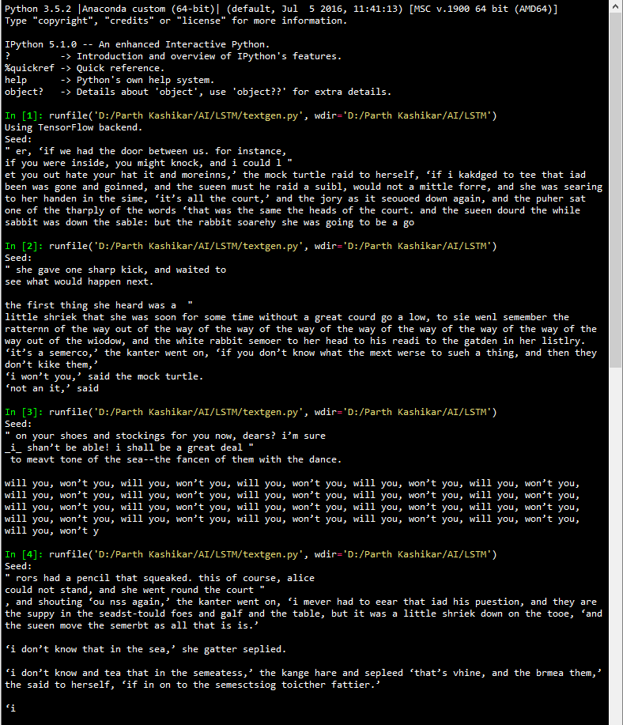 
	<figcaption style="color:black;">Results after 4 hours of training</figcaption>
</figure> 
As it can be seen, one of the outputs has become an infinite loop. This can happen due to the 'temperature' of the softmax function being used in the keras model. Altering this parameter will lead to better outputs. Temperature is a hyperparameter of LSTMs (and neural networks generally) used to control the randomness of predictions by scaling the logits before applying softmax. Performing softmax on larger values makes the LSTM more confident (less input is needed to activate the output layer) but also more conservative in its samples (it is less likely to sample from unlikely candidates). Using a higher temperature produces a softer probability distribution over the classes, and makes the RNN more “easily excited” by samples, resulting in more diversity and also more mistakes.
{: .notice}
<figure>
	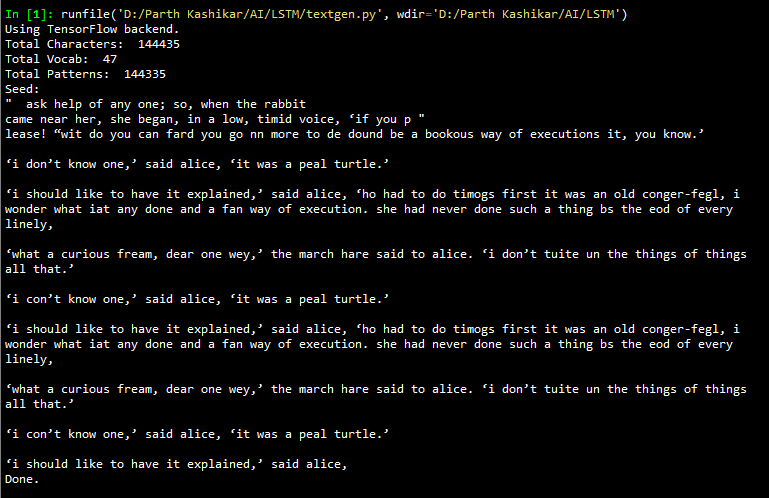 
	<figcaption style="color:black;">After 13 hours of training</figcaption>
</figure> 

You can clearly see improvement in spellings and sense alike. The network <strong>architecture</strong> is clearly capable of learning English almost perfectly, given the computation power and input text corpus to work with. Witht eh right amount of training to keep overfitting in check, our desired results are very much possible.

## Suggested Readings and sources
<ul>
<li><a href = "http://karpathy.github.io/2015/05/21/rnn-effectiveness/">http://karpathy.github.io/2015/05/21/rnn-effectiveness/</a></li>
<li><a href = "http://www.wildml.com/2015/09/recurrent-neural-networks-tutorial-part-1-introduction-to-rnns/">http://www.wildml.com/2015/09/recurrent-neural-networks-tutorial-part-1-introduction-to-rnns/</a></li>
<li><a href = "https://iamtrask.github.io/2015/11/15/anyone-can-code-lstm/">https://iamtrask.github.io/2015/11/15/anyone-can-code-lstm/</a></li>
<li><a href = "https://deeplearning4j.org/lstm.html">https://deeplearning4j.org/lstm.html</a></li>
<li><a href = "http://colah.github.io/posts/2015-08-Understanding-LSTMs/">http://colah.github.io/posts/2015-08-Understanding-LSTMs/</a></li>
<li><a href = "http://www.wildml.com/2015/10/recurrent-neural-networks-tutorial-part-3-backpropagation-through-time-and-vanishing-gradients/">http://www.wildml.com/2015/10/recurrent-neural-networks-tutorial-part-3-backpropagation-through-time-and-vanishing-gradients/</a></li>
</ul>

