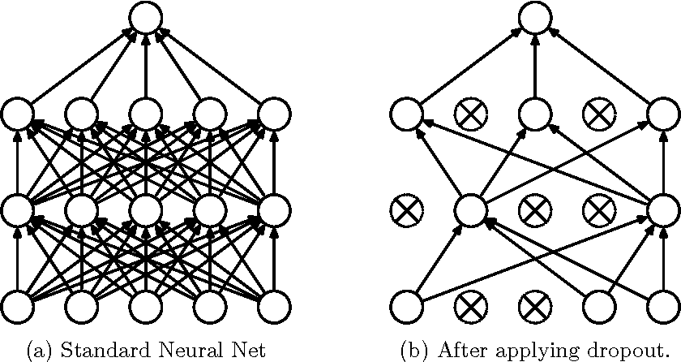

## Introduction

This blogpost is meant for those who are interested in the mathematical fundamentals behind the cutting-edge implementation practices in Deep Learning. The following sections are going to be purely theoretical with little to no coding application involved directly in contrast to my previous project-based posts. The main idea is to remove the mentality of "hiding behind libraries and abstractions" as opposed to using these to aid an overall research interest, with a certain level of necessary transparency in the understanding of the inner workings of standard models.    

I will be covering the mathematical approach and aiming to develop an intuitive notion among the readers regarding three different practices - Dropout, Batch Normalization, Data Augmentation (both training and testing data) and finding the right learning rates (a considerably under-researched topic in Deep Learning). I consider these to be very relevant in the recent models which gives them the edge over standard training procedures. 

## Dropout

Overfitting is a primary concern in medium to large neural networks. No dataset is a perfect representation of all possibilities that could be encountered by a neural network when making predictions. Overfitting leads to EXACT representation of the parameter-loss relationship between the network and the GIVEN data. This implies that when the network encounters data that is slightly deviated from the training dataset, it's accuracy suffers a considerable drop.

Dropout, much like L1 and L2 regularization, is a technique that is implemented to prevent overfitting in neural networks. In simple terms, dropout refers to "cutting-off" some nodes from the network at random (or pseudo-randomly), during a given forward and backward pass. More technically, At each training stage, individual nodes are either dropped out of the net with probability p or kept with probability 1-p, so that a reduced network is left; incoming and outgoing edges to a dropped-out node are also removed.

A given dataset might have biases with respect to one given feature, which might not apply to all kinds of data of the given situation. There might be co-dependencies among features and hidden nodes which we DO NOT want the network to learn, as these are specific to the training data, and not applicable to the general scenario. Dropout does the exact job of preventing such unwanted co-dependencies to be learned, and forces the network to understand the dataset in a more <b>robust</b> and <b>generalized</b> sense. In every forward and backward pass, the nodes cannot assume the presence or absence of any other node, achieving a relatively more independant form of learning. It creates a randomly "crippled" version of the neural network and forces learning upon it. 

Another key feature of dropout is that the probability of shutting a node off from the main network can be individually chosen. By this, I mean to say that whichever layer is the largest in terms of connections and node size, can be forced with a dropout of higher probabilities than layers where overfitting is not that much of a concern. This is because most of the fitting and overfitting happens in the largest layers of the network. The output layer is always given a dropout of zero, as we want the prediction to be spanning the entire intended dimensions. 

 

The <b>math behind dropout</b> is pretty straightforward. During training, in every given forward and backward pass, every hidden layer is given a "binary mask" containing 1's and 0's for respective nodes chosen to be active and shut off respectively (the mask will be random with probability 'p' for 0 to be multiplied with a given node). In forward pass, the hidden layer is then scalar-mutiplied by this mask, along with standard activation functions with the previous layer as input. This leads to the mask being applied in backprop as well, due to the chain rule of differentiation. This ensures that the same nodes are inactive during a given forward pass and backpropagation as well. The mask is then regenerated for the next pass, and the process is repeated.

During testing time, we simply replace the binary mask vector with the expectation vector. This means that if 'p' was 0.5, the mask will now be replaced with a vector containing 0.5 for every node in that given layer of nodes. This can be shown rigourously to be equivalent to a geometric mean for all the reduced neural networks generated with the binary masks, and can be thought of as the "average neural network" for the given dropout regularization. 

A disadvantage of dropout is that the cost function is not stable in definition, as the parameters internally are vaninishing and coming into existence. This leads to a slower convergence which is slightly unstable in nature but each forward and backward pass is faster, as some nodes are not functional. The results after convergence are more generalized, as was the whole point. Keras has a really simple way of implementing dropouts in their models, and I urge the reader to try training a simple CNN on MNIST with and without dropout to see the difference. 
