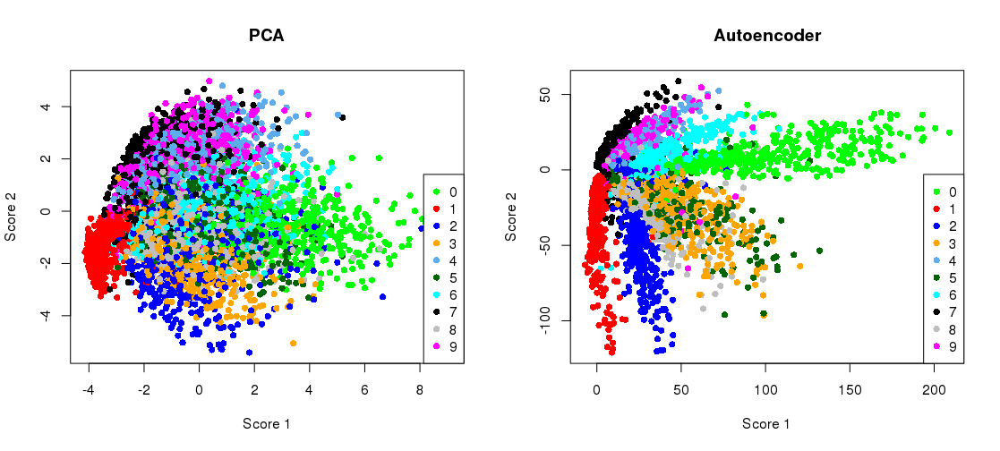
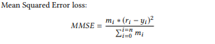
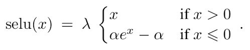
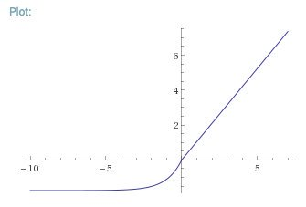

## Introduction to Autoencoders

In Deep Learning, Autoencoders are a set of neural networks that are used to generate the value of the input, as their trained output. The following is a typical representation of an Autoencoder (Underfit Autoencoder) :

 

### Breakdown

Lets discuss every part in the above represenation briefly (with the assumption that the autoencoder is trained):

Encoder : This part of the autoencoder comes up with a lower dimension representation for the input data, meaningful in some way, with the dimension equal to the number of nodes in the code layer, to be precise. Let's call that function f(x).
Code : This layer of the autoencoder is the one with the lowest dimension representation of the input data, and contains only the salient features of the data which lead to learning, while cutting away unnecessary patters in the training data, as it's dimensions are forced to be smaller than that of the data itself.
Decoder : This part of the autoencoder generates the input data back up from the code layer into the dimensions of the input data itself, basically understanding the meaning of the coded representation. It learns from the coded representations and comes up with the generating function g(x), where g(f(input)) = input = output (perfectly trained).

### Intuition

So what's really happening is that the encoder part of the network is going to come up with a composite (if multiple layers) function to map the input to a lower dimension space, and then the decoder is trying to come up with a function to do the exact opposite. Given the structures of each, their dimensionalities need not necessarily be equal, hence we cant necessarily call the wight matrices as the inverse of the other, even though g(f(x)) = x, as their composite dimensions could be entirely distinct from one another. Every technique implemented on autoencoders, from activation functions to network depth as well as reguarizations are to help in the encoder extracting the meaningful information from the data into the autoencoder code layer. This overall guideline has proven to be quite helpful in predicting the positive and negative impacts of constraints applied onto the network. Batch_Norm for example, applied in the middle of the encoder or decode, leads to a very high loss, and very little training, as the network now has to come up with functions that deal with a normalization (that too a batchwise normalization) of its input.

Basically, we're trying to extract the meaning features to represt data in a low dimension space than its initial representation. Following is an example of MNIST being used with a Deep Autoencoders, and setting the code dimension as 2 :

 

Note how the clusters formed are visually meaningful, where the network tries to set its weights in such a way that the coded (x,y) are similar for two examples of the same digit. This is the crux of feature extraction, and to an extent, even data compression (although there are better methods to compress data), as after training, the encoder and decoder don't necessaril;y have to be used together, and can be used over a network sending across only the coded data, for example. 

### How to train Autoencoders?

Autoencoders may be thought of as being a special case of feedforward networks, and may be trained with all of the same techniques, typically minibatch gradient descent following gradients computed by back-propagation. Unlike general feedforward networks, autoencoders may also be trained using recirculation, a learning algorithm based on comparing the activations of the network on the original input to the activations on the reconstructed input, and I have included the paper proposing this method in the "Sources and Readings" section of this post. 

Autoencoders are different from a simple identity function because of the change in layer dimensions, regularization applied to them, or both. Autoencoders are not trained to be a perfect copying machine, as that is not really helpful. The purpose of autoencoders (in most cases) lies in the code layer, which is a lower dimension representation (or higher) of the same data. All of the implementation practices regarding Autoencoders are so that the neural network learns the most relavant features in it's coding layer.

A new addition to forward and backward passes on batches of the training data is 'data-refeeding' in the specific case of recommnder systems. This done to maintain stability in the network. A perfect recommender would recommend the same recommendations for a batch of users as its own predictions. Hence we take the output for every forward pass of the training data, and then feed that in as the input, with itself as the target output. 

## Regularization:

One of the details mentioned above is that the coded dimension is smaller than the input itself. This is only true for an "Underfit Autoencoder". There are "Overfit Autoencoder", which are exactly opposite. Here, the network isn't forced to compress the data and still be able to keep it meaningful, hence the learning occurs from regularization practices. The following are the overviews of the major regularization practices when it comes to training these kind of networks:

Sparse Penalty : In a 'sparse autoencoder', there is a sparsity penalty applied to the code layer, in addition to the reconstruction error. 
Denoizing Autoencoders : In such a regularization, the autoencoder is fed corrupted input, and the reconstruction loss is based on the pure input and autoencoder output Euclidean distance (or some other measure of similarity)
Penalizing Derivatives : Another strategy for regularizing an autoencoder is to use a penalty as in sparse autoencoders, but the penalty is based on the magnitude of the gradient vector of the code layer with respect to the input vector. This forces the code layer to become less sensitive to changes in the input, forcing the autoencoder to learn more generalized features.
Dropout : In the NVIDIA model, a dropout regularization has been applied to the code layer, making the decoder more generalized to the data it deals with, although dropout regularization seems to relatively uncommon is general practices regarding autoencoders. Thocae amount of dropout, and its ltion of application have both been experimentally determined. 

## The NVIDIA model

The NVIDIA dataset is [] in dimensions, with ratings for each user for each movie over (1998-2016). The proposed autoencoder is meant to generate recommendations for the users on the basis of their previous movie ratings. This kind of filtering is popularly reffered to as collaborative fltering, and is different from content based filtering where the algorithm understands the content preferance of the user. Collaborative filtering works on the simple assumption that users with a similar taste in movies will tend to have high ratings for similar movies.

The proposed model is as follows :
//model.png

The model takes in a sparse input with the known ratings of each user for every movie (0 if not rated), creates a dense code of the input, and outputs a dense matrix of the same dimensions as the input, with predicted ratings of the user.

### Loss function : 

 

We are generating a loss function that is targeted to output the input ratings as the predicted ratings, for the given movies. If I have already rated a movie 5, the recommender should recommend the rating of this movie to be 5, for me. Similar logic is applied over a set of movies for a given user, and on a bigger scale over all the users. The autoencoder comes up with the links between users and their movie preferences on it's own as it is exposed to multiple combinations of users and movie preferences. (This is not a standard loss function, I'll be uploading the code on my GitHub to change tensorflow source code to implement it in tflearn, and other standard tf classes)

### Effect of the activation function :
For autoencoders to work well, it has been experimentally shown that the least constricting activations tend to work better than those which may lead to inhibition in function generation. As mentioned in the paper the two important properties for the activation function to have good impact on the training are :
a) A negative part
b) Boundless positive part

This rule is dataset specific, and is mostly proven by experiment. The function chosen by NVIDIA researches is the SELU function : 

 

### Effect of the layer depth : 
In general cases network depth has considerable benfits in Autoencoders. In single layer autoencoders, the mapping from the input to the code is shallow, preventing us from using a lot of constraints such as the sparsity penalty very effectively. A deep autoencoder, with at least one additional hidden layer inside the encoder itself, can approximate any mapping from input to code arbitrarily well, given enough hidden units. Depth can exponentially reduce the computational cost of representing some functions. Depth can also exponentially decrease the amount of training data needed to learn some functions. Experimentally, deep autoencoders yield much better compression than corresponding shallow or linear autoencoders.

One point to note here is that in many autoencoders, the encoder and decoder are made to be mirror images of each other. This enables us to constrict he weight matrices of the encoder to be the transpose of the weight matrices of the decoder (as that would be the property of the perfect solution in such a case, the math is elementary but I urge the reader to work it out for a simple case of 2 layers each), and the same applies to gradients, halving the effective trainable parameters. (This is also known as 'weight-linking' or 'tying weights'). 

The NVIDIA paper states that the RMSE of the test data reduced with increasing depths of 128 hidden units each but this reduction slowed down eventually. Upon using scikit-optimize (a library for hyperparamter tuning), for 40 epochs of training, I arrived at the best depth of 9 layers of 212 units each, but then manually tweaked around a little to arrive at the final model :
//model2.jpg

## TensorRT 

Inferencing is typically a nasty step amongst the list of computationally expensive processes needed to be carried out frequently. In production level applications, every customer request requires at least one inference from the trained neural network. Traditional packages such as Tensorflow and PyTorch do come with optimizations for inferencing, but these are still computationally demanding for GPU based inferencing, increasing both the latency and prices of maintaining such servers and carrying out AI based solutions in production, where there is a large number of 'queries per second' or 'QPS'.

NVIDIA recently launched their inferencing optimization package 'TensorRT' for GPU-based computations. Once the neural network is trained, TensorRT enables the network to be compressed, optimized and deployed as a runtime without the overhead of a framework.The following are some of it's key features : 

Layer and tensor fusion and elimination of unused layers: TensorRT parses the network computational graph and looks for opportunities to perform graph optimizations. These graph optimizations do not change the underlying computation in the graph: instead, they look to restructure the graph to perform the operations much faster and more efficiently.

FP16 and INT8 reduced precision calibration: Most deep learning frameworks train neural networks in full 32-bit precision (FP32). Once the model is fully trained, inference computations can use half precision FP16 or even INT8 tensor operations, since gradient backpropagation is not required for inference. Using lower precision results in smaller model size, lower memory utilization and latency, and higher throughput.

Target-specific autotuning: During the optimization phase TensorRT also chooses from hundreds of specialized kernels, many of them hand-tuned and optimized for a range of parameters and target platforms. As an example, there are several different algorithms to do convolutions. TensorRT will pick the implementation from a library of kernels that delivers the best performance for the target GPU, input data size, filter size, tensor layout, batch size and other parameters.

Efficient memory reuse (especially effective with Volta Architecture of GPUs): TensorRT also reduces memory footprint and improves memory reuse by designating memory for each tensor only for the duration of its usage, avoiding memory allocation overhead for fast and efficient execution. This is especially effective with the "TensorCore" architecture of the recent Volta GPUs.

TensorFlow Support: TensorFlow models can be directly ingested, optimized and deployed with up to 18x faster performance compared to TensorFlow framework inference on Tesla V100.

TensorRT produces inferences at a considerably higher throughput (much lower latency), and also is efficient in terms of power requirements. I've used TensorRT models when load-testing the model to be deployed to production.

## Results of the Deep Autoencoder

The following is the cost function during training. There are jumps, and not a constant descent due to the "data-refeeding" mechanism that I mentioned earlier. 

 

