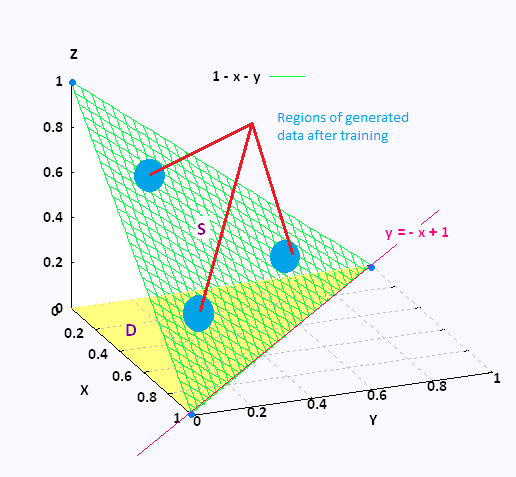

---

layout: post
title:  "Using Damped Wasserstein Metrics to generate novel Art"
hero: ../uploads/model.png
overlay: red
published: true

---

## GANGogh 

One of the most popular attempts at novel art generation that I came across during my study of GANs wwas a project called "GANGogh" which was the result of a semester long independent research performed by Kenny Jones and Derrick Bonafilia (both Williams College 2017) under the guidance of Professor Andrea Danyluk. 

The following are some details of the final outcome of the research (not diving too deep into the mathematics behind the scenes).

Dataset : The WikiArt dataset, which is a collection of over 100,000 paintings all labeled on style, genre, artist, year the painting was made, etc. This dataset contained enough images for convergence as well as contained well documented information regarding the artist-wise, subject-wise as well as era-wise painting styles adopted for every image in the dataset itself, which has been utilized in the project.

Model : The model has been inspired by an improved Wasserstein metric implementation of an extenstion to the AC-GAN architecture. 

The discriminator is trained to identify images from the dataset versus images from the generator network (real/fake), and also identify the class of style to which the image belongs. The generator network, on the other hand, is trained to fool the discriminator into believing that the generated images are "real" (much like the Vanilla GAN philosophy), but is provided with an addition conditional vector to produce an image of a certain style. The discriminator network has also been heavily pre-trained, for mutiple reasons, but the main one being that too much of the learning curve was beng wasted on understanding real/fake art, and the generator was not responding well to the conditioning vector, as the genre understanding was not being dealt with.

This is achieved by adding a penalizing term to our generator that tries to minimize the cross-entropy of the discriminator’s prediction versus the genre it was instructed to make based on the conditioning vector. There is also extensive usage of "global conditioning". The idea behind global conditioning is that every time we perform an activation function between layers in our network, we can use the conditioning vector to influence how this activation occurs, and this conditioning vector can be used differently on a layer by layer basis.

For a better intuition, the discriminator is trained to recognize artistic images and their classes (cross entropy losses for one-hot labels),and the generator is trained to produce real looking art, with a given class.

 

 

## CAN: Creative Adversarial Networks

Another research paper published around the same time was titled "Creative Adverserial Networks". In this paper, it was argued as follows :

"....At equilibrium the discriminator should not be able to tell the difference between the images generated by the generator and the actual images in the training set, hence the generator succeeds in generating images that come from the same distribution as the training set. Let us now assume that we trained a GAN model on images of paintings. Since the generator
is trained to generate images that fool the discriminator to believe it is coming from the training distribution, ultimately the generator will just generate images that look like already existing art. There is no motivation to generate anything creative. There is no force that pushes the generator to explore the creative space. Let us think about a generator that can cheat and already has access to samples from the training data. In that case the discriminator will right away be fooled into believing that the generator is generating art, while in fact it is already existing art, and hence not novel and not creative."

This is the major issue of the GANGogh project, according to this paper. The only source of "novelty" here is the noise vector input being converted to the painting. The generator agent by itself is not really being "creative". 

The setup for this version is similar to the prvious version, except one big difference. The generator is trained to produce images that the discriminator classifies as "real" art (signal one), but is unable to definitely classify into any one "style" (signal two), basically trying to maximize stylistic ambiguity. 

"These two signals are contradictory forces, because the first signal pushes the generator to generate works that the discriminator accepts as “art,” however if it succeeds within the rules of established styles, the discriminator will also be able to classify its style. Then the second signal will heftily penalize the generator for doing that. This is because the second signal pushes the generator to generate style-ambiguous works. Therefore, these two signals together should push the generator to explore parts of the creative space that lay close to the distribution of art (to maximize the first objective), and at the same time maximizes the ambiguity of the generated art with respect to how it fits in the realm of standard art styles."

 

## Assesment of the CAN model

Consider a dataset with 3 categories possible. Assume that we have a fully trained discriminator and gnerator network, trained to their theoretical convergence. Any image being inputted to the discriminator network will lead to a class probability output of 3 dimensions, effectively mapping out into 3D space.

In other words, every point on a plane with the equation X + Y + Z = 1 will represent a possible picture. 

 

At convergence, the generator will try to produce an image that lies at the point X = Y = Z = 1/3, because we have trained it to maximize style ambiguity. In most cases, it will lead to an "abstract" (not to be confused with the class of abstractionism itself) painting being produced, which wont resemble any class more than others. This is an issue, because we would like our generator network to produce obvious content-based art at certain occasions as well as abstract paintings. The issue that I am pointing out can be seen clearly in most of artwork showcased in the CAN paper. 

 

<figure>

<figcaption>Most of the art here is not representative of any specific "style", due to the result of its training</figcaption>
</figure>

## My model

In my implementation, I try to integrate a model which is truly forced to explore a "creative space" as well as not veer away from all of the stylistic qualities that the discriminator understands about the art, making it more natural and appealing. The following is the loss function that I will be implementing to deal with the aforementioned issues:

//Loss function

//graphical representation of what is happening

The whole point of Art is that it is experienced, learned and created by Humans. In this field, human-like "damped" learning and generation are a great way to explore "creativity", and network training needs to represent that aspect of this problem statement. This is exactly what I hope to achieve by the loss function and training procedures that I will be adopting for the results.

## Results

 //results go in here

## Future Work and further scope 

//improvements possible

Further scope in this study include creation of more natural feeling novel artistic style transfer algorithms produced by a pre trained generator network,game-art generation, and similar principles of damped training could even be tried out with music production!  

