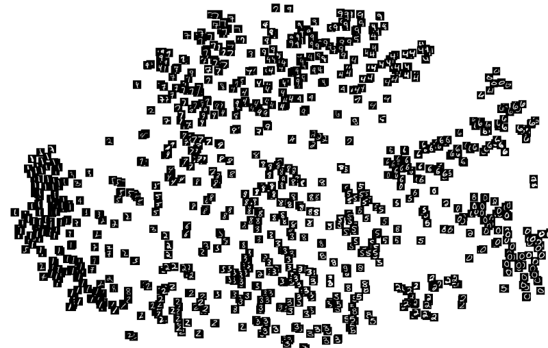

---

layout: post
title:  "Fixing Mode Collapse in GANs using Guided Latent Spaces"
hero: ../uploads/generator_loss.PNG
overlay: orange
published: true

---

## Introduction

Generative Adversarial Models have really kicked off ever since Ian Goodfellow published his paper on them a few years ago. There have been major advancements and vast applications of GANs including Wasserstein GANs, Stack GANs, Wave GANs, etc. This study is an effort to understand one of the key underlying problems of the GAN architecture, known as "mode collapse" and to attempt at preventing and/or removing mode collapse from GANs in general.

For this final objective, the following analysis is quintessential in understanding the situation in it's entirety:

<ul>
<li>How do Generative and Discriminative Networks work? What is their "learning curve"? (Brief overview only)</li>
<li>What is the cause of mode collapse?</li>
<li>Personal attempt to fix the problem</li>
</ul>

The subsequent sections shall span my explorations in all of the aforementioned subtopics, followed by my outlook and attempt to tackle the problem at hand. 

## Discriminator networks - functioning

The following is the loss function while training a Discriminator network during GAN training: (this is the Vanilla setup, but the intuition is similar for more recent GAN setups as well)

 

In simpler terms, we are providing the Discriminator with both real and generated samples of data, and penalizing it for predicting the real samples to be fake, and the generated samples to be real. The tricky part here is that, we aren't really making sure that the Discriminator ONLY learns the features of the real data distribution, and hence be able to distinguish it from the the generated data (although this might be the intended solution). The data distribution generated from the generator network is also impacting the learning process of the discriminator in unexpected ways, which is a part of the mode collapse problem. We'll come back to this later while discussing mode collapse.

It is extremely important to include the generated image part in the Discriminator loss function, as this induces a lot of stability and leads to consistent Discriminator outputs of real to fake probability, to be used eventually for the Generator Network. Hence, we cannot simply remove that aspect of the loss function.

{: .notice-alert}

## Generator networks - functioning

The following is the loss function while training a Generator network during GAN training:

 

Diving a bit deeper into the problem, the basic intention of the loss function is to use the Discriminator gradients as a means for the Generator Network to converge to a mapping to the real data distributions. As we train the Generator by feeding ion random noise inputs to generate from and computing the loss function on the generated data, the Nash Equilibrium expectation is that the Discriminator outputs a probability of 0.5 for both real and generated images, as they become indistinguishable from one another. 

The Generator Network (after training) is basically a mapping from a "latent space" of the dimensions of our Generator input, to the "real space" in which the real data distribution is depicted. Every random input to the Generator then corresponds to an output generated data point to be weighed as real or fake by the Discriminator. Here comes the kicker to all this, and to the method that I will be proposing : <b>The Generator Network learns certain directions (linear/non-linear) or rather, lower dimensional regions, to map to a certain specific feature of the real data distribution in order to fool the discriminator regardless of the input fed into it.</b> The following picture is a t-SNE latent space on the MNIST dataset, wherein clusters are formed for similar digits, indicating that the mapping function in this case has been able to extract features meaningful to human beings and encode it into regions of the latent space.

 

The fact that meaningful features have been encoded into the various directions/regions of the latent space can be showing by doing arithmetic on the latent space representations of known data points as mapped by a trained function approximator :

 

This is a similarity between Autoencoders and GANs. For Autoencoders, the Encoder is forced to extract meaningful information from an input data point, and encode the point into its latent space, for the Decoder to eventually decode back into the real space. In GANs, the Generator Network is forced to attribute regions in it's input latent space to meaningful features of the real data distribution to which it maps out random inputs points to, for convergence of generating real-seeming data points (fooling the Discriminator).

A fairly important point to be noted here is that the mapping from the "latent space" to the "real space" is many to one, implying that multiple points in the former can lead to the same result in the latter.

## Mode Collapse 

Now that we have some intuition about the learning curves and Nash Equilibrium of GAN training, for both the Generator and the Discriminator Network, let's take a look at mode collapse. 

1) Suppose that we are presented with the following data distribution :

 

2) Our Generator Network starts producing the following data distribution and starts fooling the Discriminator:

 

3) Here, we link back to the part we discussed about how the Discriminator is forced into learning that the generated data is fake. After some training, the Discriminator counters this by learning that the following data points are real :

 

and essentially starts guessing on the following data, as it is indistinguishable in it's realness or fakeness :

 

4) The Generator then exploits the Discriminator by starting to generate another cluster that resembles a part of the real data distribution :

 

...and this whole process repeats for ever changing "modes" of the data distribution. This is mode collapse. 

This game of cat-and-mouse repeats ad nauseum, with the generator never being directly incentivized to cover both modes. In such a scenario the generator will exhibit very poor diversity amongst generated samples, which limits the usefulness of the learnt GAN. In reality, the severity of mode collapse varies from complete collapse (all generated samples are virtually identical) to partial collapse (most of the samples share some common properties). Unfortunately, mode collapse can be triggered in a seemingly random fashion, making it very difficult to play around with GAN architectures.

Clearly, Mode Collapse is an <b>architectural</b> problem.

## The fix

In my attempt, I view the basic problem of mode discovery as well as mode retention to fool the Discriminator. The most effective way to understand the real data distribution is via the use of a neural network classifier appropriately trained on the data. Let's assume we have a given data distribution, on which we fully train a classifier. We are now dealing with three spaces, the space with the real data distribution represented in the standard form, the classification space of the newly trained network, and the space from which our generator maps out of. 

The idea I propose is to develop a mechanism for the generator to be able recognise to various possible data clusters/modes at the same time, without constantly trying to just fool the discriminator. For this, we jump into a latent space, with extended dimensions as compared to a latent space dimensionality for the standard benchmark of the given dataset, intentionally. We then come up with a way to sectionalise the given space, into smaller subspaces, which then would be used to train the GAN as the regular generator method procedure. 

This is done because given the standard latent space dimensions, we can make sure that the generator has enough scope to map out the entire dataset, making our subspaces large (dimensionally) enough for the generator to work with. But, mode collapse cannot be prevented here, simply because it is an inherent fault in the training procedure. Now, each of these subspaces is restricted to generate data of one mode specifically, with a penalizing factor that we can account for by using our classifier network.

To provide further clarity, let us analyze the proposed model on the MNIST dataset for the scope of this article. Firstly, we train a CNN classifier on the dataset to near perfection. 

From then on, the following diagram depicts the training loop of the modified GAN being proposed.

 

//loss function

As seen, the loss function resembles closely the Vanilla GAN implementation, but with changes in the Generator loss function, now incorporating the losses due to CNN classifier as well as statistical parameters per batch, to maintain variety in the outputs per class. If the statistical loss aspect is disregarded, the Generator could just output a single digit for each class, regardless of the random input being provided to it, just based on the class label part of the input, and be able to bypass both the classifier and real/fake discriminators with ease. The values of the variances are taken to be equal to the real data variance as measured by the classifier.

The following shows the intended mapping for the Generator from the latent space (extended) to the real space.

 

## Results 

 

As seen, the training is progressive towards mode retention, and variability within the modes. The "further possibilities" section can give some insights into how to improve the current model that I propose, and will be the key focus of my future work in this field.

## Further possibilities 

The following studies are worth looking into :
<ul>
<li><b>The penalizing factor from the classifier</b></li>  - The loss function is based on the Vanilla Implementation of GANs, not accounting for Wasserstein metrics, and hence relatively unstable. Also, the statistical and classification loss parameters could potentially be better refined for the problem at hand.
<li><b>Getting rid of the Discriminator entirely</b></li> - As compared to Conditional GANs, the use of statistical parameters is better guided if we use a pretrained classifier to solve mode collapse, but a merger of the real discriminator with the aforementioned could lead to more efficient computations.
<li><b>Intentionally weighting the gradient contributions to the loss functions and analasying the gradients closely</b></li> - Guided cost weightages could be fine tuned for more stable training and quicker convergence, and the Shannon Entropy contributions due to the random and discrete parts of the problem could be further analyzed.
<li><b>Dimensional study, deciding the dimensions of the encoder vs. latent space</b></li> - GANs need a dimensional analysis. As of now, most of latent space representations are based on empiricism, and a fomalised approach to this problem could prove beneficial in preventing mode collapse (lesser likelihood for using one mode as a scapegoat).
</ul>

## References 

<ul>
<li><a href = "https://arxiv.org/pdf/1406.2661.pdf">https://arxiv.org/pdf/1406.2661.pdf</a></li>
<li><a href = "https://github.com/uclaacmai/Generative-Adversarial-Network-Tutorial/blob/master/Generative%20Adversarial%20Networks%20Tutorial.ipynb">https://github.com/uclaacmai/Generative-Adversarial-Network-Tutorial/blob/master/Generative%20Adversarial%20Networks%20Tutorial.ipynb</a></li>
<li><a href = "https://cs.stanford.edu/people/karpathy/gan/">https://cs.stanford.edu/people/karpathy/gan/</a></li>
<li><a href = "https://medium.com/@jonathan_hui/gan-unrolled-gan-how-to-reduce-mode-collapse-af5f2f7b51cd">https://medium.com/@jonathan_hui/gan-unrolled-gan-how-to-reduce-mode-collapse-af5f2f7b51cd</a></li>
<li><a href = "https://arxiv.org/pdf/1804.04391.pdf">https://arxiv.org/pdf/1804.04391.pdf</a></li>
<li><a href = "https://www.exptechinc.com/machine-learning/fighting-gan-mode-collapse-by-randomly-sampling-the-latent-space/">https://www.exptechinc.com/machine-learning/fighting-gan-mode-collapse-by-randomly-sampling-the-latent-space/</a></li>
<li><a href = "https://www.youtube.com/watch?v=ktxhiKhWoEE">https://www.youtube.com/watch?v=ktxhiKhWoEE</a></li>
<li><a href = "https://arxiv.org/pdf/1411.1784.pdf">https://arxiv.org/pdf/1411.1784.pdf</a></li>
<li><a href = "https://openreview.net/pdf?id=HJxyAjRcFX">https://openreview.net/pdf?id=HJxyAjRcFX</a></li>
</ul>